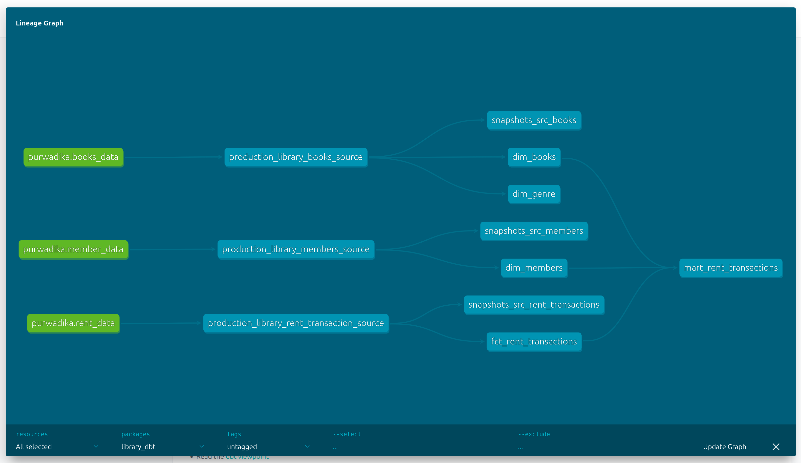

# Data Engineering Final Project


This project serves as the **Final Project** for the **Data Engineering Program at Purwadhika Digital Technology School**. It showcases multiple data pipelines and processes designed to simulate real-world data engineering tasks.

The project is divided into three core components:

- **Ingesting data** from a local **PostgreSQL database** (with randomly generated dummy data using the Randomizer API) into **Google BigQuery**.
- Utilizing **dbt (Data Build Tool)** for data transformation to create **dimensional tables**, **fact tables**, and **datamarts**.
- **Web scraping** public company data using **Selenium** (for dynamic web interaction) and **BeautifulSoup** for HTML parsing.

To orchestrate these processes, I used **Apache Airflow**, which manages workflows through **DAGs (Directed Acyclic Graphs)**. Airflow provides a **scheduler** and a **web server**, making it easier to configure, monitor, and maintain each pipeline.

For containerization, I leveraged **Docker**, which allows all necessary services and applications to run consistently across environments. Docker **networks** were used to ensure seamless communication between services.

## 🛠 Tools & Technologies

- **Docker** – for containerization and environment consistency  
- **Apache Airflow** – for orchestrating data pipelines  
- **PostgreSQL** – as the initial data source  
- **Google BigQuery** – as the data warehouse  
- **dbt** – for data transformation and modeling  
- **Selenium** – for dynamic web scraping  
- **BeautifulSoup** – for parsing static web content

## Airflow and Docker

For this project, I utilized **four separate Docker Compose files** to demonstrate communication using **Docker networks**. Each file has its own specific functionality, as described below:

1. **`prod_airflow_db`** – Sets up the database to store Airflow metadata.  
2. **`prod_airflow_service`** – Initializes and runs Airflow's scheduler and webserver (accessible via port `8080`).  
3. **`dbt`** – Sets up and runs dbt for data transformation.  
4. **`app_db`** – Initializes a local PostgreSQL database.

All services are connected using a shared Docker network named **`application-network`**, which is initialized by the `prod_airflow_db` Docker Compose. Therefore, the `prod_airflow_db` service must be started **first**.

### 🔧 Running the Services

To run all Docker Compose services simultaneously, navigate to your project directory and execute the following commands in order:

```bash
docker compose -f prod_airflow_db/docker-compose.yaml up -d
docker compose -f prod_airflow_service/docker-compose.yaml up -d
docker compose -f app_db/docker-compose.yaml up -d
docker compose -f dbt/docker-compose.yaml up -d
```

After running the Docker Compose services, you can open port `8080` in your web browser. The website will prompt you for a username and password, which are configured in `prod_airflow_service`. You can use the following credentials:

user: airflow
password: airflow

To run a DAG, you can either unpause it by clicking the button to the left of the DAG name or click the "Run" button in the "Actions" field.


You can monitor your DAGs by clicking the DAG name and selecting the specific DAG process you want to view details for.

While in production, the Airflow webserver runs continuously. However, for testing purposes, you can stop the services by running the following commands in your project directory:

```bash
docker compose -f prod_airflow_service/docker-compose.yaml down
docker compose -f app_db/docker-compose.yaml down
docker compose -f dbt/docker-compose.yaml down
docker compose -f prod_airflow_db/docker-compose.yaml down
```

## Local PostgreSQL to BigQuery data pipeline

I created the dummy data using randomuser.me (for users data) and openlibrary (Books Data) APIs. The datasets consist of user data, book data, and rent data, simulating a use case of a public library. The database choosen for this project is **PostgreSQL** as it's a reliable and well documented, often used by companies.

The data pipeline developed aims to simulate a process of ingesting data from an OLTP database, designed for real-time transactions in production, to an **OLAP** database, that is **intended for analytical use**.

The OLAP database or **Data Warehouse** I decided to use is BigQuery, provided by Google Cloud Platform. To interact with BigQuery using our script, we need a service account key. To get that, the process is mainly straightforward:

- Create a service account in the **Service Account** section of the **IAM & Admin** page.
- Grant permissions of which cloud service we want to give access to. (In this case **"BigQuery Admin"** or "BigQuery Data Editor")
- Create and download the Key, in the **Keys Tab**.

After we got our key, the next step is to use it to interact with our Bigquery Python Client library installed using pip.

The ingestion process are in three steps: **(1)** We first ingest it from the PostgreSQL database and store it in a temporary CSV file, **(2)** then we ensure the dataset is created in BigQuery (or creating it if it doesn't exist), and **(3)** lastly ingest the data from the temporary file and ingest it incrementally to our staging tables.

Lastly, I use upsert (using `MERGE` query on the latest data) to ingest data the production tables. Ensuring in Analytics production there is no duplicate data found.

## dbt for Data Transformations

dbt is used for **transforming data in the ELT (Extract Load Transform) process**, where the data is ingested first in the Data Warehouse then transformed.



In this project, using the 3 tables from the Ingestion process, we transform those tables into **Dimensional and Fact Tables**, cleansing it to ensure correct data format or to add any necessary columns. We use those tables to create **Datamarts**, tables that is intended for specific analysis or business case.

To use dbt in Docker, my method is to use a **custom Dockerfile** installing `dbt-core` and `dbt-bigquery`, running it on the docker compose file. I then give access to Airflow in acessing our `docker.sock` enabling us the give commands directly to our docker containers. 

This in result, helps us to give commands to directly to our dbt containers. Utilizing the `BashOperator` to give `dbt run` commands to each specific tasks (source tables, fact & dim tables, and datamarts).

## Web Scraping Using Selenium and BeautifulSoup

In this process, we are tasked with **web scraping public data** from a financial lender company, Asetku. To do this, we utilize two libraries: **Selenium** and **BeautifulSoup**.

**Selenium** is an open-source tool primarily used for automating web browsers. It is often used by quality assurance engineers to automate testing of web applications. In this case, we use Selenium because the web page we want to scrape loads data dynamically using JavaScript. Therefore, we use Selenium to act as a web browser, waiting until the page is fully loaded.

We then use **BeautifulSoup** to parse the HTML page we ingested and find the specific data we need to scrape. BeautifulSoup helps us locate the correct HTML tags containing the desired data.