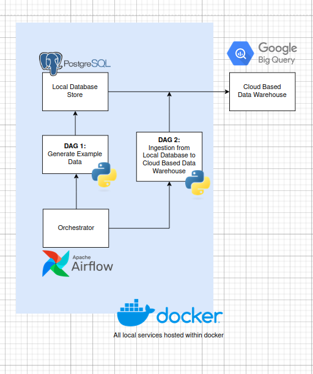
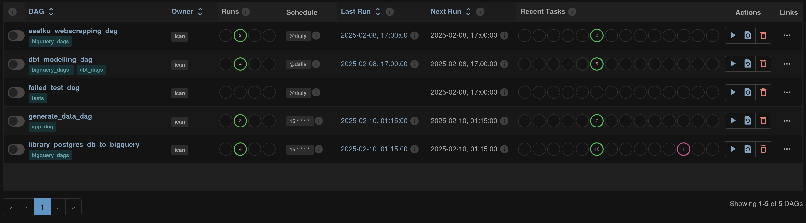
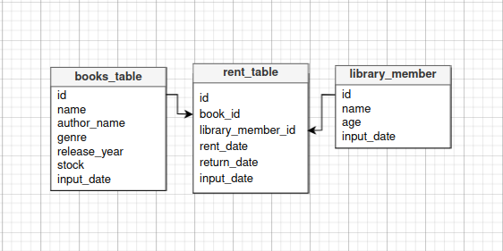
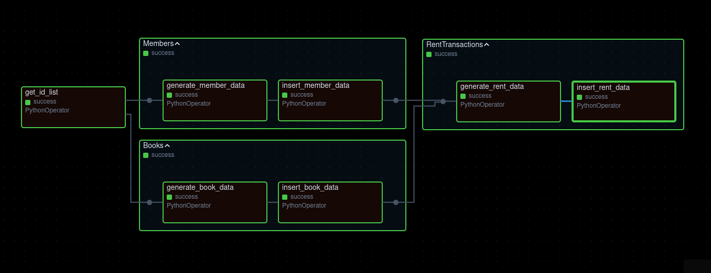
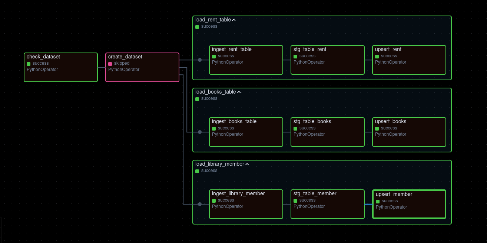

# Capstone Project 3

Repository ini adalah hasil kerja saya untuk tugas Capstone Project ke-3 Kelas Data Engineering Purwadhika. Secara garis besar saya diminta untuk membuat data pipeline yang mengutilisasi Airflow sebagai *orchestrator* terhadap dua DAG (Directed Acyclic Graph). Kedua DAG tersebut bertujuan untuk:

1. Generasi *dummy data* dan menyimpannya dalam suatu database (PostgreSQL)
2. melakukan ingestion data tersebut dari database ke Google BigQuery.

Graph dibawah dapat dilihat sebagai gambaran umum project dari ini.



## Overview

Dalam project, kita diminta membuat Kedua DAG tersebut dalam suatu studi kasus. Studi kasus yang saya pilih adalah sistem data pipeline untuk suatu perpustakaan yang menyimpan data Buku (Books), anggota (Member), dan sewa (Rent). 

Penggunaan airflow adalah untuk orkestrasi *task* dalam suatu satuan waktu yang dapat di otomatisasi. Dalam kasus ini, kita akan mengambil data dari database perpustakaan (yang kita akan generate dummy data seakan database operasional) dan memasukkannya kedalam BigQuery. *Task* tersebut kita akan desain untuk berjalan setiap jam pada menit 15, membantu menghilangkan perlunya laporan manual dari tim operasi dan data didapatkan secara cepat tanpa perlu menunggu anggota tim lain.

Google BigQuery merupakan suatu Data Warehouse, tempat dimana data disimpan untuk kebutuhan analisis. Pemisahan penyimpanan data antara operasional dan analisis ini akan berguna agar proses analisis tidak bisa menganggu proses operasional yang berjalan sangat dinamis. BigQuery juga dioptimisasi untuk kebutuhan analisis dari bagaimana service tersebut melakukan Storage dan Pricing agar lebih cost and time efficient.

Project ini menggambarkan proses pipeline dari source (database perpustakaan) ke cloud data warehouse (Google BigQuery) untuk persiapan analisis. Penggunaan analisis pun bisa bermacam-macam, contohnya dalam use-case perpustakaan untuk table `rent` kita bisa melihat buku apa saja yang paling sering dipinjam sehingga perlu penambahan stok ataupun penulis siapa saja yang memiliki sewa terbanyak sehingga bisa memberikan insight komersil.

### Tools

- Docker
- Airflow
- PostgreSQL
- Pandas
- Google BigQuery

## Cara Menggunakan

Untuk menjalankan project ini, kita menggunakan docker. Dalam project ini, kita menggunakan 5 services yaitu 2 PostgreSQL database yaitu `application_db` dan `airflow_db`. `application_db` untuk menyimpan secara lokal geneasi data kita dan `airflow_db` untuk menyimpan metadata Airflow. Lalu kita menggunakan 3 services Airflow yaitu, `init_airflow` untuk meng*intialize* airflow, `webserver` yang menghost webUI airflow untuk kita berinteraksi dengan airflow, dan `scheduler` yang menjalankan orkestrasi yang telah didesain.

Sebelum menjalankan kita juga harus memastikan bahwa port local yang kita gunakan 5432 sedang tidak dipakai. Jika masih dipakai maka service app_db tidak akan berjalan. Jika memang port 5432 tidak bisa dimatikan kita bisa mengubahnya menjadi local port lain, namun jangan diubah untuk container portnya (e.g. 5433:5432, port kedua jangan diubah) karena tetap bisa berjalan dan sudah sesuai dengan DAG script.

Satu hal yang diperhatikan adalah penggunaan docker network. Docker network dibentuk dalam file docker-compose bersama `airflow_db` Dengan menggunakan network, hal tersebut memudahkan komunikasi antar container. Kita hanya perlu menggunakan nama service sebagai *host* dan menggunakan container port yang kita tuliskan didalam file `docker-compose.yaml`. Hal ini juga meningkatkan security, karena seluruh komunikasi antar service dilakukan dalam suatu internal network, hal ini membantu kita untuk mengawasi dan mengatur external access dengan lebih mudah.

Namun, karena docker network tersebut dibuat dalam file docker compose untuk `airflow_db`, maka kita harus menjalankan docker compose tersebut terlebih dahulu agar network dipersiapkan sebelum digunakan container lain. Hal itu dapat dilakukan dengan menjalankan command dibawah di directory project ini.

```
docker compose -f prod_airflow_db/docker-compose.yaml up -d
docker compose -f prod_airflow_service/docker-compose.yaml up -d
docker compose -f app_db/docker-compose.yaml up -d
```

Setelah itu kita bisa membuka webserver airflow di browser dengan membuka `localhost:8080`. Di dalam web UI tersebut, karena project kita didesain untuk dijalankan setiap satu jam, kita hanya perlu mengeser tombol yang berada disebelah DAG kita.



jika ingin memberhentikan service kita berikan command:

```
docker compose -f prod_airflow_service/docker-compose.yaml down
docker compose -f app_db/docker-compose.yaml down
docker compose -f prod_airflow_db/docker-compose.yaml down
```

## DAGs (Directed Acyclic Graphs)

### (1) Create data and insert to PostgreSQL

Dalam DAG pertama kita, kita diminta untuk generate database dengan schema seperti:




Masing-masing tabel memiliki *primary key* masing-masing yang menjadi *foreign key* didalam table *rent_table*. *primary key* juga berurutan, memudahkan kita untuk menggunakan *primary key* terakhir untuk menggenerasi *primary key* selanjutnya.



#### Get ID list
Dari gambar diatas, kita dapat melihat bahwa sebelum kita generate data, kita akan mengambil id list dari masing-masing tabel di PostgreSQL (akan menjadi 0 pada generate pertama), hal ini dilakukan untuk memastikan meng-generate id baru.

#### Generate Data
Cara untuk menggenerate data tersebut adalah dengan menggunakan API random name generator untuk nama member dan OpenLibrary untuk Judul Buku.

Lalu setelah itu kita menjalankan secara bersamaan generate data pada tabel `books_table` dan `library_member`. Hal ini dilakukan terlebih dahulu, karena untuk generate data pada `rent_data` kita akan mengambil id dari dua tabel sebelumnya dan dipilih secara random.

#### Insert to PostgreSQL
setelah semua data di generate, kita akan masing-masing insert datanya kedalam PostgreSQL dengan menggunakan *library* psycopg2 melalui helper file `postgres_app_helper`.

### (2) PostgreSQL to BigQuery

Dalam DAG ini, kita diminta untuk melakukan ingestion dari data yang telah kita generate sebelumnya ke Google BigQuery.



Proses dari DAG ini didahulukan dengan menggunakan task `check_dataset` yang akan mememeriksa apakah dataset sudah tersedia pada BigQuery target. Tergantung hasil return dari *check_dataset*, jika `True` maka `create_dataset` task akan menjalankan pembuatan dataset. Bila hasil return `False` , maka task `create_dataset` akan di skip sebagaimana graph diatas.

#### Trigger Rule

Karena task sebelumnya di skip, kita harus memastikan `trigger_rule` untuk task selanjutnya. Karena secara *default* `trigger_rule` yang digunakan adalah `all_success`, yang memastikan bahwa task sebelumnya harus berhasil berjalan. Kita akan mengubah value `trigger_rule` dalam task selanjutanya menjadi `none_failed`, karena dalam kasus ini task sebelumnya di skip namun tidak *failed*.

#### YAML file for dynamic DAGs

Dalam membuat DAG ini, kita menggunakan yaml file sebagai configuration file yang menyimpan detail informasi tabel kita. Penggunaan file yaml membantu karena ini dapat digunakan untuk *dynamic dag*, menggunakan template untuk beberapa table yang berada di configuration file.

Seperti yang kita lihat diatas setiap table diproses dengan template task yang sama. (1) kita melakukan ingestion dari PostgreSQL dengan library pandas dan menyimpannya sebagai csv dalam temporary storage kita, (2) kita melakukan load staging table dengan menggunakan Google Cloud Python API secara incremental, dan (3) kita melakukan upsert ke final table kita secara incremental.

#### Upsert Table

Penggunaan staging table dengan final/production table membantu untuk memastikan bahwa final table sudah siap digunakan dan segala pemrosesan yang belum selesai dilakukan di staging table.