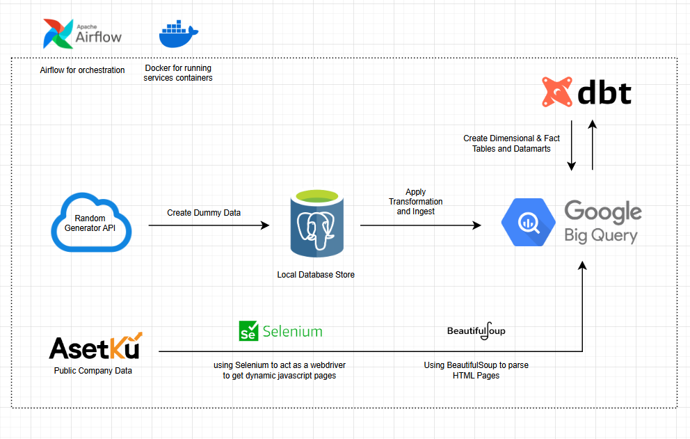

# Final Project Data Engineering Bootcamp Purwadhika



***DAG 1 & 2 Diambil dari [Capstone Project 3](https://github.com/icanooooo/capstone_project_3)***

Repository ini bertujuan untuk menyelesaikan Final Project untuk kelas Data Engineering Purwadhika. Final Project ini melanjutkan dari Capstone Project 3, dimana kita diminta untuk menggenarasi data untuk suatu studi kasus (library untuk studi kasus pilihan saya) dan membuat pipeline ke Google BigQuery.

Untuk Final Project, kita akan melanjutkannya dalam 3 hal:

1. Membuat alert yang dikirimkan ke discord jika terjadi *failure* terhadap task. [**Diimplementasikan ke setiap DAGs/Tasks**]
2. Membuat *preparation layer, Dim & Fact Tables, and Datamarts* menggunakan Data Build Tool atau dbt. [**DAG 3**]
3. Membuat web-scraping terhadap suatu website (pilihan saya: [Asetku](https://www.asetku.co.id/)) dan memasukannya kedalam Google BigQuery. [**DAG 4**]

Untuk mengirimkan *failure message* ke discord, kita akan menggunakan *webhook* yang menyediakan url yang bisa kita lakukan melakukan method *post* dari library *requests* untuk mengirimkan pesan.

dbt adalah suatu tool yang digunakan untuk transfomasi data yang biasanya sudah berada didalam data warehouse, atau lebih sering disebut dengan ELT process berperan sebagai 'T' dalam proses tersebut. Tools ini menggunakan file SQL sebagai dasar untuk proses transformasi dan bisa menggunakan Jinja, suatu *templating language*, untuk membuat kueri SQL menjadi dinamis dan modular. dbt seringkali digunakan oleh para *Analytics Engineer* untuk menyediakan data yang siap digunakan oleh end-users.

kita juga melakukan webscrapping yang dijalankan oleh DAG menggunakan dua tools yaitu BeautifulSoup untuk parsing HTML dan selenium untuk berinteraksi dengan halaman web dengan menggunakan WebDriver. Webscraping adalah suatu teknik dimana kita mengambil informasi melalui halaman web tertentu.

### Tools

- Docker
- Airflow
- PostgreSQL
- Pandas
- Google BigQuery
- dbt
- BeautifulSoup
- Selenium


## Cara Menggunakan

Untuk menjalankan project ini, kita menggunakan 4 service yaitu:

1. prod_airflow_db : Menyimpan metadata airflow.
2. prod_airflow_service : Initialize Airflow dan meng-*host* scheduler dan webserver airflow (menggunaka port 8080).
3. dbt : Instalasi dbt-core dan dbt-bigquery.
4. app_db : Menyimpan data PostgresSQL untuk generated data. (Menggunakan port 5432)

Untuk komunikasi 4 service ini, kita akan menggunakan docker network `application-network` yang terbentuk oleh service prod_airflow_db. Untuk itu kita harus menjalankan service tersebut lebih dulu agar antar service bis berkomunikasi.'

Menggunakan docker network membantu untuk menjaga mengawasi karena komunikasi antar service akan ter*contain* dalam satu network. Semua komunikasi yang berada diluar network tersebut dapat lebih mudah diawasi dan dimaintain.

Untuk menjalankan dockernnya, kita bisa menjalankan `docker compose up` dalam tiap directory service tersebut atau bisa jalankan command dibawah:

```
docker compose -f prod_airflow_db/docker-compose.yaml up -d
docker compose -f prod_airflow_service/docker-compose.yaml up -d
docker compose -f app_db/docker-compose.yaml up -d
docker compose -f dbt/docker-compose.yaml up -d
```

Jika menggunakan windows (Windows Powershell or Command Prompt) dan tidak bisa jalan bisa coba dijalankan dengan mengganti `/` dengan '\',

Setelah itu kita bisa membuka webserver airflow di browser dengan membuka `localhost:8080`. Ketika membuka UI kita akan diminta user and password yang bisa kita isi dengan info dibawah:

user: airflow
password: airflow

Di dalam web UI tersebut, karena project kita didesain untuk dijalankan setiap satu jam, kita hanya perlu mengeser tombol yang berada disebelah DAG kita.


jika ingin memberhentikan service kita berikan command:

```
docker compose -f prod_airflow_service/docker-compose.yaml down
docker compose -f app_db/docker-compose.yaml down
docker compose -f dbt/docker-compose.yaml down
docker compose -f prod_airflow_db/docker-compose.yaml down
```

## DAG Failed Alert (Final Project Update)


Disini kita membuat fungsi untuk memberikan suatu pesan menuju Discord Server kita apabila suatu DAG menghadapi suatu failure. Untuk mengirimkan pesan melalui discord, kita pertama harus membuat webhook untuk di discord sebagai 'akun' yang akan mengirimkan pesan.

Setelah membuat webhook, kita mengambil urlnya dan menggunakan library `requests` dan method `post` untuk mengirimkan pesan.

Fungsi yang dibuat akan mengambil informasi dari context (*failure* di DAG) lalu mengambil nama, task, dan exception (Error message) dari task dan DAG yang *failed*.

Secara business process, kegunaan *failed alert* ini dapat membantu kita untuk lebih mudah mengawasi jalannya DAG kita. Setelah airflow digunakan untuk ***Production*** terkadang bisa saja ada kegagalan yang terjadi karena terdapat masalah yang tidak dikembangkan/perhitungkan saat development. Oleh itu kita bisa menggunakan Alert untuk mengawasi *Airflow* tanpa harus membuka UI Airflow setiap saat.

## Web Scrapping for Asetku Website (Final Project Update)

Untuk melakukan webscraping, kita menggunakan kedua BeautifulSoup untuk parsing html dari halaman yang kita tari dan Selenium untuk menggunakan Webdriver browser kita agar berperan seakan data yang diambil melalui browser.

Kita harus mengambil data menggunakan Selenium karena halaman yang kita ambil menggunakan Javascript untuk menyediakan datanya secara dinamis melainkan menuliskannya di html polos. 

Pertama kita load halaman menggunakan `webdriver.Chrome` dari library `selenium. Lalu kita parsing html `page_source` dari halaman yang kita ambil menggunakan BeautifulSoup. Kita akan ambil seluruh `div` tag dengan class `name` dan `amount` didalam `div` tag yang berada didalam class `content-row-1`. Berikut dibawah gambar yang kita akan ambil datanya melalui webscrapping melalui website [asetku](https://www.asetku.co.id/).


## dbt-Airflow Implementation (Final Project Update)

#### What is dbt?

dbt adalaj suatu tool yang digunakan untuk transformasi data yang bisa digunakan didalam proses ELT, dimana data di*load* terlebih dahulu sebelum di transformasi. 

dbt menggunakan kueri sql sebagai template model dan Jinja yang bisa membantu kueri bisa digunakan kembali dan menjadi dinamis.

#### Source Tables

*Source tables* merupakan tabel yang biasa diambil dari luar sistem kita kedalam data warehouse yang dipilih. Tabel ini biasanya tidak di transform terlebih dahulu, menyediakan data sebagai *raw* untuk ditransformasi di tabel yang lain. 

Dalam project ini, kita menggunakan dataset dan tabel yang berada di final project kita sebagai source untuk *source table* kita. 

#### Fact and Dimensional Tables

Fact dan dimensional table merupakan tabel yang sudah ditransformasi dan dibersihkan. Tabel tersebut seharusnya sudah dalam data type yang sesuai dan tidak memiliki data duplikat (oleh karena itu di buat menjadi incremental table).

Facts table merupakan tabel yang menyimpan data terukur dan memiliki *foreign key* kepada dimensional tables. Tabel ini menyimpan data numerikal yang bisa dianalisis dan diagregasi.

Dimensional table adalah tabel yang menyimpan data yang memiliki atribut deskriptif. Membantu untuk mengkategorisasi, filter, dan *grouping* terhadap *fact tables* untuk kebutuhan analisis.

#### Datamarts

*Datamarts* adalah tabel yang dibentuk untuk kebutuhan analisis tertentu (business group or department) menggunakan data yang didapatkan dari *fact* dan *dimensional tables*.

#### Snapshots

*snapshot* adalah cara untuk *tracking* perubahan data dengan menyimpan historical version data tersebut. Hal ini diimplementasikan dengan **type 2 SCD**, dimana perubahan disimpan dan diinfokan melalui kolom tambahan.

Dengan memisahkan tabel *snapshots* dengan tujuan tracking tersendiri, proses analisis tidak dapat terganggu jika kita ingat melihat version history data kita. 

Untuk memastikan data yang dimasukan kedalam data model kita adalah yang terupdate, kita pastika tabel kita merupakan incremental table dengan menggunakan kolom `updated_at` sebagai panduan. 

#### Airflow-dbt Implementation


Dalam project ini, untuk menggunakan dbt dalam airflow, kita menggunakan docker compose yang berada directory berbeda dengan Airflow. Kita membentuk docker-compose dengan menggunakan Dockerfile custom untuk instalasi `dbt-core` dan `dbt-bigquery`. Kita juga harus meletakan folder project untuk dbt dalam directory yang sama.

`library_dbt` sebagai directory yang menyimpan project dbt kita, `profiles` sebagai directory yang menyimpan profile dbt kita, dan `logs` untuk menyimpan file logging untuk proses dbt. Kita juga membuat folder `keys` yang menyimpan file service-account.json untuk koneksi dengan BigQUery. 

Setelah kita sukses instalasi dbt dengan docker, kita lalu bisa mengkoneksikan airflow dengannya. Hal ini kita lakukan dengan cara memastikan airflow memiliki akses terhadap docker kita. Hal ini dilakukan dengan cara mounting docker.sock kita ke dalam volume (isi di volume docker compose: `/var/run/docker.sock:/var/run/docker.sock`).

Jika sudah terkoneksi kita bisa langsung menggunakan *BashOperator* untuk memberikan command kepada service dbt kita. Setiap task untuk dag ini menggunakan template berikut:

```
docker exec dbt-dbt-1 dbt run --select {model} --target {target dataset} --profiles-dir {directory profile dbt} --project-dir {director project dbt}
```

Dengan menggunakan file `app_db.yml` sebagai config, kita bisa membuat commandnya secara dinamis. Ketika membuat model baru, kita tidak memerlukan untuk merubah commandnya, hanya perlu menambahkan ke dalam file config kita.

Setelah itu kita akan buat 4 task dalam dag ini untuk masing jenis tabel (`dbt_run_src`,`dbt_run_dim`,`dbt_run_fact`, `dbt_run_mart`) dengan setiap task menjalankan BashOperator untuk command masing-masing.
