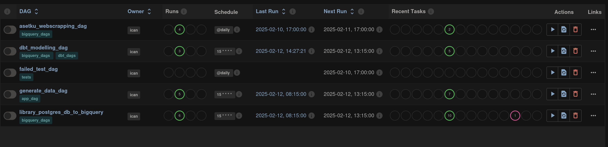

# Data Engineering Final Project


This project serves as the **Final Project** for the **Data Engineering Program at Purwadhika Digital Technology School**. It showcases multiple data pipelines and processes designed to simulate real-world data engineering tasks.

The project is divided into three core components:

- **Ingesting data** from a local **PostgreSQL database** (with randomly generated dummy data using the Randomizer API) into **Google BigQuery**.
- Utilizing **dbt (Data Build Tool)** for data transformation to create **dimensional tables**, **fact tables**, and **datamarts**.
- **Web scraping** public company data using **Selenium** (for dynamic web interaction) and **BeautifulSoup** for HTML parsing.

To orchestrate these processes, I used **Apache Airflow**, which manages workflows through **DAGs (Directed Acyclic Graphs)**. Airflow provides a **scheduler** and a **web server**, making it easier to configure, monitor, and maintain each pipeline.

For containerization, I leveraged **Docker**, which allows all necessary services and applications to run consistently across environments. Docker **networks** were used to ensure seamless communication between services.

## 🛠 Tools & Technologies

- **Docker** – for containerization and environment consistency  
- **Apache Airflow** – for orchestrating data pipelines  
- **PostgreSQL** – as the initial data source  
- **Google BigQuery** – as the data warehouse  
- **dbt** – for data transformation and modeling  
- **Selenium** – for dynamic web scraping  
- **BeautifulSoup** – for parsing static web content

## Airflow and Docker

For this project, I utilized **four separate Docker Compose files** to demonstrate communication using **Docker networks**. Each file has its own specific functionality, as described below:

1. **`prod_airflow_db`** – Sets up the database to store Airflow metadata.  
2. **`prod_airflow_service`** – Initializes and runs Airflow's scheduler and webserver (accessible via port `8080`).  
3. **`dbt`** – Sets up and runs dbt for data transformation.  
4. **`app_db`** – Initializes a local PostgreSQL database.

All services are connected using a shared Docker network named **`application-network`**, which is initialized by the `prod_airflow_db` Docker Compose. Therefore, the `prod_airflow_db` service must be started **first**.

### 🔧 Running the Services

To run all Docker Compose services simultaneously, navigate to your project directory and execute the following commands in order:

```bash
docker compose -f prod_airflow_db/docker-compose.yaml up -d
docker compose -f prod_airflow_service/docker-compose.yaml up -d
docker compose -f app_db/docker-compose.yaml up -d
docker compose -f dbt/docker-compose.yaml up -d
```

After running the Docker Compose services, you can open port `8080` in your web browser. The website will prompt you for a username and password, which are configured in `prod_airflow_service`. You can use the following credentials:

user: airflow
password: airflow

To run a DAG, you can either unpause it by clicking the button to the left of the DAG name or click the "Run" button in the "Actions" field.



You can monitor your DAGs by clicking the DAG name and selecting the specific DAG process you want to view details for.

While in production, the Airflow webserver runs continuously. However, for testing purposes, you can stop the services by running the following commands in your project directory:

```bash
docker compose -f prod_airflow_service/docker-compose.yaml down
docker compose -f app_db/docker-compose.yaml down
docker compose -f dbt/docker-compose.yaml down
docker compose -f prod_airflow_db/docker-compose.yaml down
```

## Local PostgreSQL to BigQuery data pipeline


## dbt for Data Transformations
## Web scraping using Selenium and BeautifulSoup